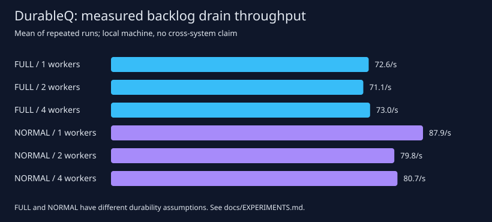

# DurableQ · 持久化任务队列与故障语义研究

**一个可运行、可测试、可复现实验的计算机系统与软件工程项目。**

Python 标准库 + SQLite 实现单机多进程任务队列，研究并发领取、租约失效、
崩溃恢复、任务提交去重，以及外部副作用的重复执行问题。无需 Redis、Docker 或云账号。

项目定位：研究生课程设计 / 系统实验 / 研究原型。不是经过生产认证的消息中间件，
也不把现有队列机制包装成新的学术贡献。

## 可以研究什么

1. **安全性**：多个消费者争抢任务，过期 worker 会不会错误提交结果？
2. **故障语义**：外部操作成功、任务确认前崩溃，为什么仍会重复执行？
3. **性能与耐久性**：worker 数量、日志方式和同步策略如何影响吞吐和尾延迟？

| 能力 | 实现 / 验证 |
|---|---|
| 原子领取 | `BEGIN IMMEDIATE` 串行化短事务；handler 在事务外执行 |
| 租约与隔离 | 每次 claim 递增 generation；随机 token + 持久化 deadline |
| 崩溃恢复 | 过期运行任务重新入队；达到尝试预算后进入 dead |
| 提交幂等 | 唯一 key + 规范 JSON 请求；相同请求返回原任务，冲突拒绝 |
| 可观测性 | 状态统计、任务结果、与状态更新同事务提交的事件记录 |
| 验证 | 确定性时钟、spawn 多进程争抢、真实 `os._exit` 故障、有限状态模型 |
| 实验 | 6 组配置 × 3 次重复，原始 JSON/CSV、P50/P95/P99、实测 SVG |

## 五分钟运行

要求 Python 3.11+。在仓库根目录直接运行，无需安装依赖：

```bash
python -m durableq --db demo.db init
python -m durableq --db demo.db enqueue sum "[10,20,30]" --key example-001
python -m durableq --db demo.db work --limit 10
python -m durableq --db demo.db stats
```

最后应得到 `{"ready": 0, "running": 0, "done": 1, "dead": 0}`。
再次执行相同的 enqueue 命令，会返回同一个任务 ID。

可选安装为命令行程序：`python -m pip install -e .`，随后使用 `durableq`。
数据库请放在本机磁盘上；先初始化，再启动多个 worker。
`work` 消费当前可领取任务，遇到空队列就退出，**不是后台守护进程**。

### Python API

```python
from durableq import Queue
from durableq.worker import run_once

Queue.initialize("queue.db")
with Queue("queue.db") as queue:
    job_id = queue.enqueue("square", {"x": 12}, key="square-request-1")
    run_once(queue, {"square": lambda claim: claim.payload["x"] ** 2})
    print(queue.get(job_id)["result"])  # 144
```

每个进程 / 线程独立创建自己的 Queue；不要共享连接或把它继承给 fork 子进程。
长任务应由应用在同一连接所属线程内主动 `renew`，或拆成小任务。
默认 worker 不自动续租；超过默认 30 秒的 handler 应显式调整 lease。

## 复现实验

```bash
python -m unittest discover -v
python -m experiments.faults
python -m experiments.model_check
python -m experiments.benchmark --jobs 160 --repeats 3 --workers 1 2 4 --work-ms 2
```

- [实际性能报告](results/REPORT.md)：包含运行环境、样本标准差及实验边界。
- [原始测量](results/benchmark.json) / [CSV](results/benchmark.csv)。
- [真实进程崩溃实验](results/faults.json)：相同任务执行两次，普通副作用发生两次，
  使用业务侧唯一键的副作用发生一次。
- [有限状态检查](results/model_check.json)：正确抽象与故意破坏的确认逻辑作对照。

本次实测在 DELETE+FULL 下，1/2/4 worker 的平均吞吐约为 72.59/71.07/72.98 jobs/s，
没有观察到明显线性扩展；claim P95 随竞争增加。这是锁与同步成本主导的小规模结果，
尚不能推广为所有 workload 的结论。



## 保证边界

任务在有限重试预算内提供**至少一次领取机会**；并不保证每个任务最终成功。
预算耗尽会进入 dead，需业务人工处理。本项目不提供多机调度、共识复制或跨数据库事务。

队列 token 只能阻止旧 worker 修改队列状态，不能撤销已经执行的网络请求或业务写入。
外部系统需要使用稳定的 `job.id` 做幂等去重，或正确验证 fencing generation。
提交幂等 key 默认永久保留；目前没有删除或保留期回收功能。

默认采用 **DELETE + FULL**。WAL 模式仅在已修复 WAL-reset 缺陷的 SQLite 版本允许启用：
主线 3.51.3+，或 3.50.7 / 3.44.6 对应修复分支。
当前本机 SQLite 3.50.4 下 WAL 测试会明确跳过，不报告为通过。
见 [SQLite 官方说明](https://www.sqlite.org/wal.html#the_wal_reset_bug)。

## 目录

```text
durableq/      队列状态机、持久化层、worker 与 CLI
tests/         并发、崩溃恢复、边界条件和实验工具测试
experiments/   性能测量、进程故障注入、有限状态检查
docs/          设计论证、实验协议、研究拓展与答辩问题
results/       实际生成的原始数据、报告与图表
.github/       Windows / Linux 自动化测试
```

进一步阅读：[系统设计](docs/DESIGN.md) · [实验协议](docs/EXPERIMENTS.md) ·
[研究拓展与答辩](docs/RESEARCH.md) · [贡献指南](CONTRIBUTING.md)。
