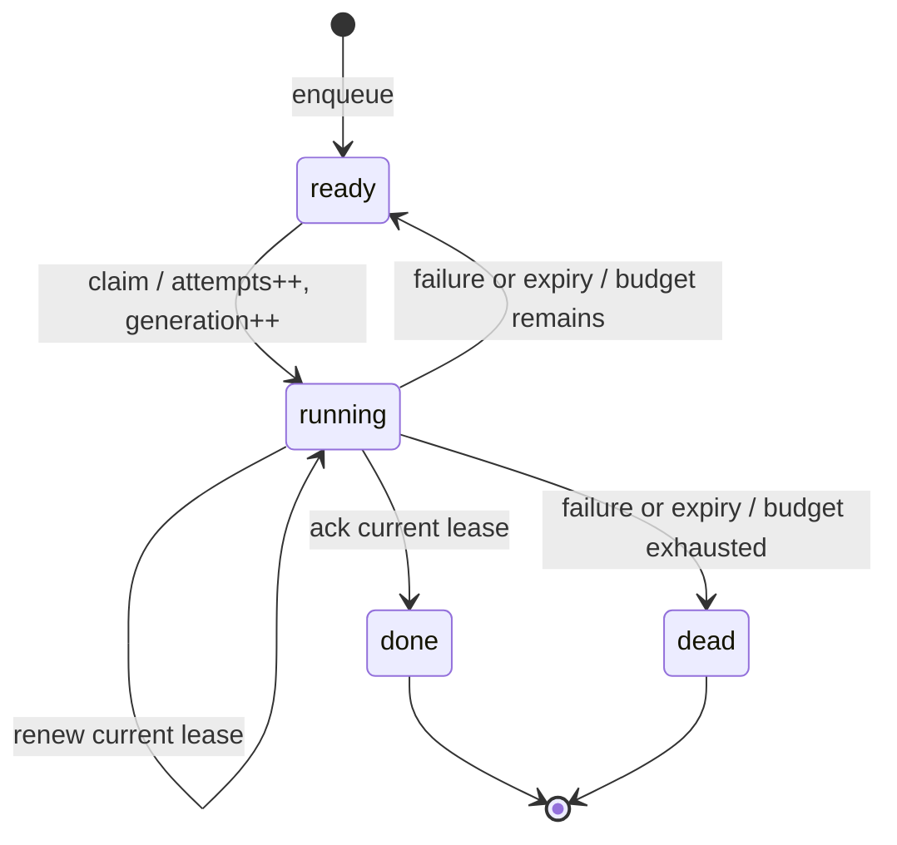

# 设计、语义与故障模型

## 1. 系统边界与假设

- 单机、本地文件系统，多进程消费者与生产者。
- crash-stop / crash-restart 故障；允许进程在任意指令间退出。
- SQLite 提供原子事务及文件锁；本项目不重新实现磁盘日志。
- 使用主机共享的 wall clock 表示跨进程租约。perf_counter 只用于实验耗时。
- 无 Byzantine worker、跨主机时钟、复制协议、网络文件系统支持。
- FULL 的实际掉电耐久性依赖操作系统、文件系统及设备正确执行同步；
  当前测试验证进程故障，未进行断电验证。

## 2. 数据模型

`jobs` 保存任务、规范请求、状态、尝试数、generation、token、deadline 和结果。
`events` 保存任务状态事件，与相应状态变更在同一事务内提交。

核心约束：

```text
idem_key 唯一（NULL 不参与提交去重）
state ∈ {ready, running, done, dead}
state = running ⇔ token ≠ NULL 且 deadline ≠ NULL
attempts ≥ 0；max_attempts > 0
```

ready 的部分索引按 priority、available、created、id 排序。
expired 的部分索引按 deadline 查找。索引降低扫描范围，但不能消除 SQLite 单 writer 瓶颈。
全部到期任务在一次 claim 事务内回收；极大过期积压可能延长锁占用，
下一步可研究分批回收，并验证公平性及饥饿问题。

## 3. 状态转移



claim、ack、fail、renew、recover、enqueue 均在 `BEGIN IMMEDIATE` 内操作。
函数调用的持久状态变更以 SQLite commit 为原子生效边界。
deadline 的准入校验使用获得 writer lock **之后**的时间：避免锁等待消耗新租约。
deadline 校验发生于事务开始时，而不是硬实时的 commit 瞬间。
若提交异常，函数报错；调用方不能把“响应没收到”当成“事务一定没提交”。
enqueue 可通过同一 key 重试；ack 响应不确定时应查询 job 状态，避免盲目重复副作用。

## 4. 不变量与论证

**唯一当前租约**：所有领取事务被 writer lock 串行化，一个 job 只有一个持久 token。
这不意味着只有一个 handler 活着：旧 worker 暂停后恢复时可能与新 worker 同时执行。

**租约 fencing**：ack/fail/renew 要求 job ID、token、generation、running 状态均匹配，
且数据库 deadline 大于本次事务采样时间。旧 generation 不能提交队列结果。

**终态不回退**：recover 只扫描 running；claim 只扫描 ready；终态不能被后续 token 改写。

**状态与审计一致**：事件写失败时，状态变更一并回滚。事件日志是诊断材料，
不是独立复制日志，也不是完整的形式化证明。

**提交幂等**：规范 JSON 包括 task、payload、priority、相对 delay 与 max_attempts。
相同 key + 相同请求返回原 ID，哪怕原任务已 done/dead；不同请求抛 Conflict。
JSON 拒绝 NaN/Infinity，字典键序不影响请求指纹。重复提交不会重算原任务的可用时间。
这里约定 payload 是标准 JSON 对象，key 为非空字符串；不接受任意 Python 对象。

## 5. 至少一次与外部副作用

```text
worker A: claim(g1) → 外部系统提交副作用 → crash（尚未 ack）
worker B: 租约过期 → claim(g2) → 再次执行副作用 → ack
```

队列最终 done 一次，但副作用可能发生两次。队列确认与外部事务没有原子性。
generation fencing 保护的是队列状态；业务系统若支持 generation 比较，可额外拒绝旧 writer，
但 generation 不能自动去掉两个不同有效 generation 顺序执行的重复请求。
对于一次性业务操作，应使用稳定 job.id 与外部唯一约束实现去重；若效果和 receipt 不在同一
业务事务中，仍存在崩溃窗口。本项目 faults 实验将 receipt 本身作为副作用，二者同事务。

## 6. 重试、活性与公平性

显式失败重试延迟为 `min(cap, base_delay × 2^(attempt-1))`，默认 1s，最大 60s。
崩溃导致的过期任务在回收后立即可用；claim 消耗一次尝试。
当前没有随机 jitter，多个同时失败任务可能同时重试，可作为扩展消融。

活性依赖仍有 worker 定期 claim/recover、writer lock 最终可获得、时钟推进、重试预算足够。
`claim=None` 表示当前无可领取任务，不意味着未来没有延迟任务。
高优先级持续流入可导致低优先级饥饿；本项目没有宣称 FIFO 公平或无饥饿。

## 7. 日志与连接管理

初始化时设置 journal；worker 打开已有库，不在热路径反复更改日志模式。
每个 Queue 一条连接，所属线程独占，默认忙等待上限 10s。SQLite 错误向调用者传播；
不在未知提交结果时自动重放 handler。

DELETE+FULL 为默认安全配置。WAL 可改善读写并行，但仍只允许一个 writer。
项目检查当前 runtime 是否包含 SQLite WAL-reset 修复；不安全版本拒绝打开 WAL 数据库。
NORMAL 只用于性能实验；不同 journal 模式下掉电语义需分别分析，不能套用同一耐久性结论。
重新 initialize 或迁移 journal 需停掉所有 worker。

## 8. 时钟及资源限制

向前跳时钟可能过早回收；向后跳可能延长租约。没有墙钟跳变容忍保证。
handler 应在外部操作前检查业务授权，不能仅凭本队列 token 控制外部安全边界。
任务和事件当前无限保留；高负载长期运行需要 retention、批量回收和监控。
本研究原型没有远程认证接口，也不暴露未经认证的 HTTP 服务。

## 参考资料

- [SQLite Transaction](https://www.sqlite.org/lang_transaction.html)：写事务与 BEGIN IMMEDIATE。
- [SQLite WAL](https://www.sqlite.org/wal.html)：读写并行、单 writer 和版本修复。
- [SQLite synchronous](https://www.sqlite.org/pragma.html#pragma_synchronous)：同步策略与耐久性。
- [SQLite Isolation](https://www.sqlite.org/isolation.html)：事务隔离与快照行为。

项目的原创工作是实现、测试组合与实验设计；上述机制来自已有系统研究和数据库实践。
